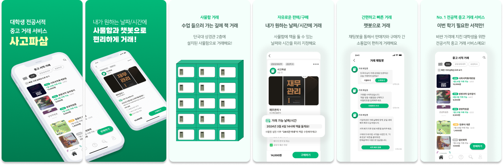

# 사고파삼 

### 프로젝트 소개

> **사고파삼**은 챗봇을 활용한 **전공서적 중고거래 애플리케이션**으로,   
> 구매자와 판매자 간 의사소통 없이 단국대학교 상경관 2층에 설치된 사물함으로  
> ”**내가 원하는 날짜와 시간**”에 책을 사고 팔 수 있어요!

### 진행 기간 👩🏻‍💻

- **2023.12.18 - 2024.02.16**

### 기술 스택

- 
  
  
  
  
  

### 구현한 기능

  

복잡한 의사소통 과정과 사기 거래 때문에 불편했던 중고거래, 중고거래의 불편함을 해소한 **사고파삼**에서는 쉽고 빠르게 필요했던 전공책을 사고 팔 수 있습니다.

**① 수업 가는 길에 거래하는, 사물함 거래**

∙ 단국대학교 죽전캠퍼스 2층에 설치된 사물함에서 내가 지정한 날짜/시간에 책을 배치/수령하면 거래가 완료돼요.

**② 구매자와 판매자 간 의사소통이 필요없는 챗봇 거래**

∙ 모든 거래 과정은 채팅봇으로 진행되며, 직접적인 소통 없이 버튼만으로 거래가 가능해요.

**③ 내가 원하는 날짜와 시간에 거래, 비대면 거래**

∙ 판매자는 사물함에 책을 배치할 수 있는 날짜와 시간을 미리 지정할 수 있어요.

∙ 판매자는 설정한 날짜에 서적을 배치하고, 구매자는 서적을 수령하면 되는 비대면 거래에요.

**④ 사기 거래 없는, 중개 구조**

∙ 중고 거래 시 가장 많이 하는 걱정 중 하나는 “입금은 했는 데 약속한 날에 거래자가 안 나오면 어떡하지?” 입니다.

∙ 이러한 걱정을 해소하기 위해 사고파삼은 구매자가 서적을 수령한 후에만 판매자가 판매금을 받을 수 있는 프로세스를 도입했습니다.

### URL

- [🔗 App Store 로 이동하기](https://apps.apple.com/kr/app/%EC%82%AC%EA%B3%A0%ED%8C%8C%EC%82%BC/id6477531087)
- [🔗Google Play 로 이동하기]() (🚧 베타 테스트 중입니다.)

### 프로젝트 후기 🙇🏻‍♀️

- 문제 해결 능력 강화
  - 프로젝트 진행 중 다양한 문제와 버그를 직면하고 이를 해결하는 과정에서 문제 해결 능력이 향상되었습니다.
  - 특히 처음 적용해보는 `Short Polling` 을 도입하는 과정에서 여러 시행착오를 겪었지만, 이를 해결하고 최종적으로 완성하는 과정에서 많은 교훈을 얻었습니다.
- 충분한 테스트의 중요성
  - QA 테스트 진행전, 내부 테스트를 충분히 진행했음에도 불구하고 QA 테스트에서 많은 버그가 발견되었습니다.
  - 이 경험을 통해 반복된 테스트와 외부적인 QA 과정의 중요성을 명확히 이해하게 되었습니다.
- 커뮤니케이션의 중요성
  - 개발팀을 대표하여 기획 및 디자인팀과의 소통을 맡으며, 서로 다른 의견을 조율하는 과정에서 좋은 커뮤니케이션의 중요성을 깊이 인지하게 되었습니다.
  - 효율적이고 명확한 커뮤니케이션을 통해 프로젝트 진행의 원활함과 결과물의 품질 향상을 이룰 수 있음을 깨달았습니다.

